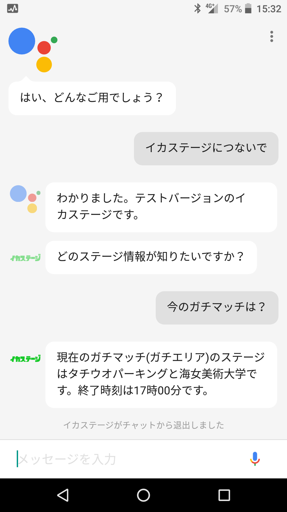

# IkaStage
スプラトゥーン2のステージ情報を取得するGoogleアシスタントアプリ  
Google Assistant app that gets stage information for Splatoon 2  

当アプリは以下のAPIを利用して作成しています。  
https://spla2.yuu26.com

## アプリ起動方法
* OK Google, イカステージにつないで
* OK Google, イカステージを教えて

## 使い方
* 今の<ルール>のステージは？
* <ルール>は何時まで？
* <ルール>のステージは？

## 利用可能なルール
* レギュラーマッチ（またはナワバリバトル）
* ガチマッチ
* リーグマッチ

## スクリーンショット

