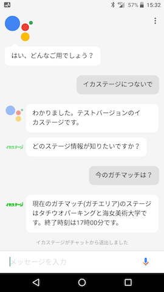
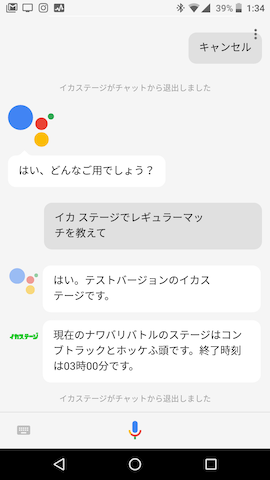

# イカステージ
スプラトゥーン2のステージ情報を取得するGoogleアシスタントアプリ  
Google Assistant app that gets stage information for Splatoon 2  

当アプリは以下のAPIを利用して作成しています。  
https://spla2.yuu26.com

## アプリを起動して対話形式でリクエストする
* OK Google, イカステージにつないで
* OK Google, イカステージを教えて
  * 今の[<ルール>](#rule)のステージは？
  * [<ルール>](#rule)は何時まで？
  * [<ルール>](#rule)のステージは？

## アクションフレーズを指定して起動する
* OK Google, イカステージで[<ルール>](#rule)を教えて

## <a name="rule">利用可能なルール</a>
* レギュラーマッチ（またはナワバリバトル）
* ガチマッチ
* リーグマッチ

## スクリーンショット

